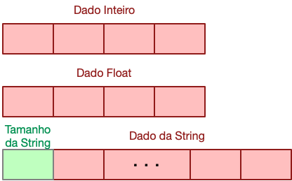

# Exercício 1 - Comunicação UART

## 1 - OBJETIVOS

Neste trabalho o(a) aluno(a) irá exercitar o acesso a dispositivos (devices) utilizando as funções de acesso à arquivos do POSIX. No caso, uma comunicação serial (UART) terá que ser implementada entre a placa Raspberry Pi e um microcontrolador Arduino.

## 2 - CIRCUITO ESQUEMÁTICO

Para conectar o Raspberry Pi ao Arduino, será utilizada a porta serial através dos pinos 8 (UART_TXD) e 10 (UART_RXD) do Raspberry Pi e ps respectivos pinos RX, TX do Arduino. Porém, é necessário observar que o Raspberry Pi opera a uma tensão de 3.3V enquanto a maioria das placas Arduino operam em 5V. Neste caso será necessário a utilização de algum método de conversão de tensão (Level Shifter, Divisor de Tensão, Optoacopladores, etc.).
```

## 4 - ROTEIRO

1. Criar um programa em C, no Raspberry Pi, capaz de usar a comunicação com a porta serial UART para ler e escrever conforme o protocolo definido abaixo:  

   a. Escrita de dados: Todas as mensagens de solicitação de dados enviadas pela porta serial devem seguir o padrão: Código do comando solicitado (Tabelas 1 e 2) + “Quatro últimos dígitos da matrícula” em formado char.Exemplo de Mensagem com o comando 0xA3 (Hexadecimal) = 163 (Decimal) e a matrícula “4521” ao final: char[] = {163, 4, 5, 2, 1};Já as mensagens de envio de dados deverão ser compostas por: Comando + Dado + Matrícula. No caso do envio de uma String, o formato deverá ser: Comando + Tamanho da String (1 byte) + String + Matrícula. 

   b. Leitura de dados: A leitura de dados deve seguir o padrão de retorno da Tabela 1. Para valores inteiros (int) ou reais (float), deverão ser lidos 4 bytes e armazenados em uma variável int ou float, respectivamente. Para leitura de strings, a mensagem de retorno irá conter o número total de caracteres da string no primeiro byte (Valor entre 0 e 255), em seguida, é possível ler o conteúdo da mensagem que deverá ser armazenada em um array de char (char[])  

   c. Cada tipo de mensagem recebida deverá ser impressa em tela (stdout).  

2. O programa deverá ser estruturado em funções e cada acesso à porta serial deve ser feito abrindo e fechando o arquivo referente ao device UART para evitar concorrência com outros usuários.

3. Finalmente, cada função de solicitação de dados ou de envio de comandos deverá ser acessada através de um menu na linha de comando.

A seguir apresentamos nas tabelas o conteúdo de cada tipo de mensagem.

<p style="text-align: center;">Tabela 1 - Códigos do Protocolo de Comunicação - Solicitação de Informações</p>

| Código |	Comando de Solicitação de Dados |	Mensagem de Retorno |
|:-:|:--|:--|
| **0xA1** |	Solicitação de dado inteiro: **integer** | int (4 bytes) |
| **0xA2** |	Solicitação de dado real: **float**	| float (4 bytes) |
| **0xA3** |	Solicitação de dado do tipo string: **char[]** | char (1 byte com o tamanho da string) + char[]( nbytes com o conteúdo da string) |
 
<p style="text-align: center;">Tabela 2 - Códigos do Protocolo de Comunicação - Envio de Dados</p>

| Código |	Comando de Envio de Dados | Mensagem de Retorno
|:-:|:--|:--|
| **0xB1** |	Envio de um dado no formato **integer**	| int (4 bytes)
| **0xB2** |	Envio de um dado no formato **float** | float (4 bytes)
| **0xB3** |	Envio de uma string: **char[]**	| char (1 byte com o tamanho da string) + char[]( nbytes com o conteúdo da string)

### O formato de cada pacote será:

1. Formato dos pacotes de **Solicitação de Dados**


2. Formato dos pacotes de **Envio de Dados**


3. Formato dos pacotes de **Recebimento de Dados**


